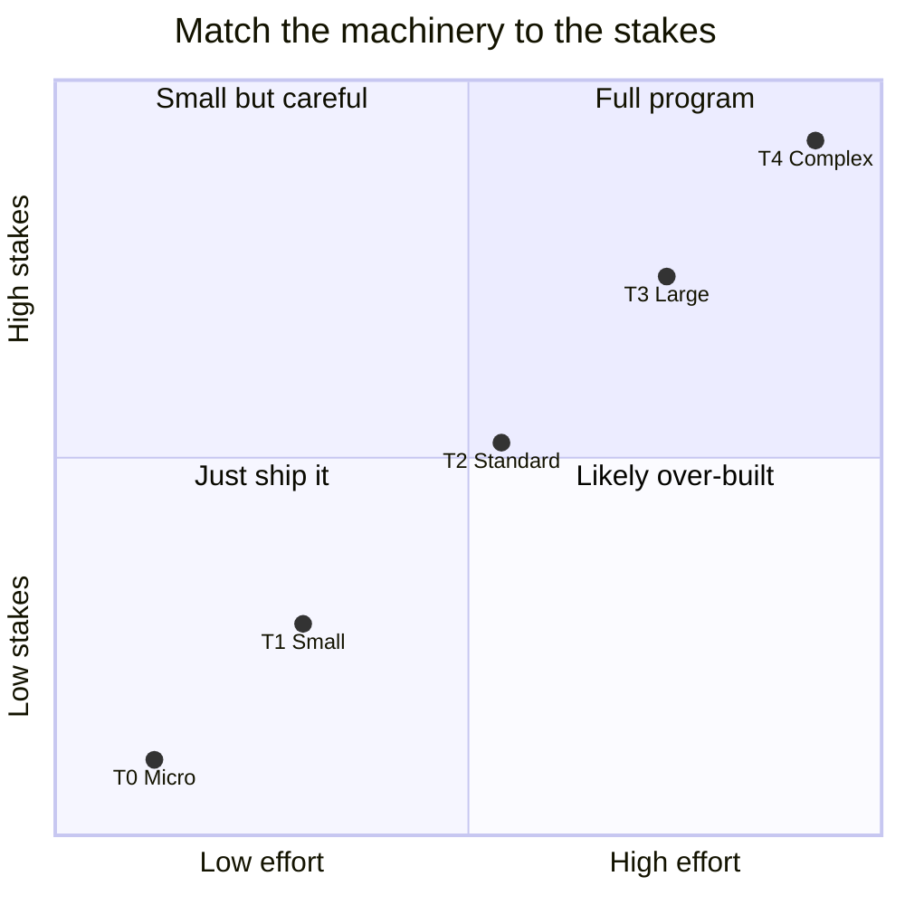
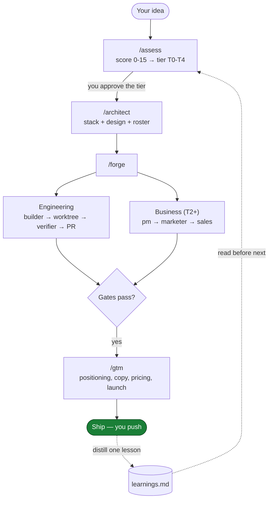
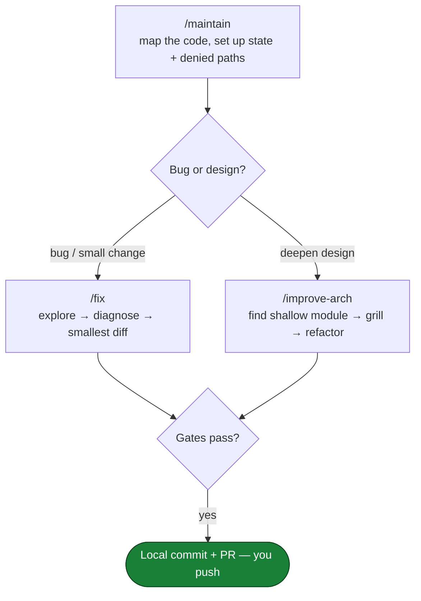
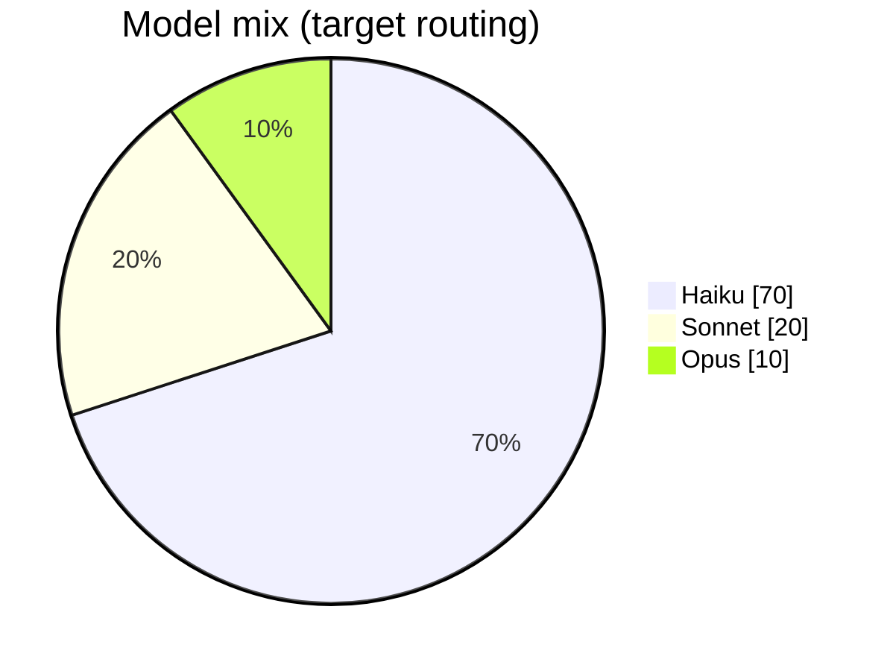

<div align="center">

<picture>
  <source media="(prefers-color-scheme: dark)" srcset="./assets/logo-dark.svg">
  
</picture>

### Turn Claude Code into a cross-functional product team that scores an idea, staffs it to its difficulty, and builds it zero-to-sell — then maintains it.

[Install](#install) · [How it works](#how-it-works) · [The team](#the-team) · [Cost model](#cost-model) · [Commands](#commands)


</div>

Plain Claude Code is a brilliant engineer with no manager. It picks a stack on a
whim, over-builds a landing page and under-builds a payment flow, skips its own
QA, pushes to `main`, and forgets every decision the moment the conversation
ends. You feel it most as a solo builder: every new project, you re-make the same
calls about scope, staffing, model spend, and what "done" means — by hand, from
scratch.

Forge puts an operating system around that engineer. You describe an idea; Forge
**scores its difficulty**, **assembles the right team** (and *only* the right
team), builds it through objective QA gates, packages it to sell, and writes down
what it learned so the next project starts smarter. Nothing reaches your remote
without you.

## Without Forge vs. with Forge

| | Plain Claude Code | With Forge |
|---|---|---|
| **Sizing the work** | You eyeball the effort | Scored 0–15 → tier T0–T4 |
| **Staffing** | One generalist, every job | The right specialists, fielded by tier |
| **Model spend** | Whatever's selected, everywhere | 70/20/10 Haiku/Sonnet/Opus routing |
| **QA** | Runs only if you remember to ask | A separate verifier gates every merge |
| **Git safety** | Can push to `main` on its own | Edits free; **push/merge/deploy are yours alone** |
| **Memory** | Forgotten when the chat ends | A learning loop that compounds across projects |
| **Selling it** | Not its job | Positioning, copy, pricing, launch plan |

## What you get

- **Right-sized effort** — every idea is scored and routed to a tier (T0–T4)
  that picks the roster, the model per agent, and the reasoning effort. A waitlist
  page doesn't get a compliance review; a fintech MVP does.
- **A full product team, not just a coder** — engineers, a verifier, a PM, a
  marketer, sales, plus design/devops/compliance when the tier earns them.
- **Two modes** — **Build** a product from zero, then **Maintain** it on its real
  codebase (explore → fix → gate), with optional always-running triggers.
- **Safe by default** — agents edit and commit freely but **can never push,
  merge, or deploy**. The wall is mechanical (config-enforced), not a request.
- **Cost control** — a 70/20/10 model mix keeps spend well under all-frontier.
- **Compounding memory** — a learning loop records where estimates missed and
  which traps recurred, then reads it back before the next assessment.

## Install

```bash
git clone https://github.com/mohammad00alavi/forge-claude.git
cd forge-claude
./install.sh /path/to/your/workspace
cd /path/to/your/workspace && claude
```

Then run `/start` for a 60-second orientation, or jump straight to
`/assess "your idea"`. Commit `.claude/memory/learnings.md` and `ventures/` so
your memory compounds across sessions.

> [!NOTE]
> **Forge never reaches your remote without you.** Agents edit, run gates, commit
> locally, and open a PR — then they stop. `git push`, `merge`, and `deploy` are
> denied to agents by config, so an unattended run can't ship on its own.

> Not affiliated with Anthropic. Forge is a configuration layer for Claude Code.

## The difficulty engine

This is the core. Every idea is scored on five axes (0–3 each): scope, technical
novelty, data/state complexity, integration surface, and risk/compliance. The sum
maps to a tier, and the tier *is* the staffing decision — roster, model, and
effort all fall out of it. **You approve the tier and its cost band before any
spend; after that it runs.**

| Tier | Score | Example | Team fielded | Model |
|---|---|---|---|---|
| **T0** Micro | 0–2 | Landing page, waitlist | architect (light) + 1 builder | Sonnet |
| **T1** Small | 3–5 | One-feature tool | + verifier | Sonnet |
| **T2** Standard | 6–9 | SaaS MVP | full eng loop + pm + marketer + manager | Opus brain |
| **T3** Large | 10–12 | B2B platform | + devops + ui-ux + sales | Opus |
| **T4** Complex | 13–15 | Regulated / novel | + compliance + 2nd verifier | Opus xhigh |

The roster isn't a fixed cast — it's a function of the score. That single table is
the staffing model, the cost model, and the "meet the team" all at once.

The whole point is to keep effort proportional to stakes — never heavy machinery
on throwaway work, never a thin pass on something that matters:



## How it works

**Build mode** — idea to sellable product. You approve the tier once, then it runs
and stops at your push:



**Maintain mode** — work on an existing codebase, manually or on a trigger:



Every step is isolated, every merge is gated, every decision is recorded.
Autonomy (when it runs) and permissions (what it can do) are separate axes:
triggers can widen *when*, but *what* stays narrow.

## The team

13 agents, each with a sharp, PhD-level persona and a single job — fielded only
when the tier calls for them.

**The brain**
- **strategist** *(Opus)* — the only agent that scores, tiers, and delegates.
  Holds the whole board in its head; stops for your approval before spend.
- **manager** *(Sonnet, T2+)* — keeps the engineering and business tracks in sync,
  owns venture state, and writes the learning loop.

**Engineering**
- **architect** *(Opus)* — picks the stack and designs the system; allergic to
  over-engineering. Finalizes the roster.
- **builder** *(Sonnet, T1+)* — the maker. Implements the smallest viable diff in
  an isolated worktree, test-first, never expanding scope.
- **verifier** *(Haiku, T1+)* — the checker. Sees only the spec and the artifact,
  never the builder's reasoning, and re-runs every gate. The maker never grades
  its own homework.
- **devops** *(Sonnet, T3+)* — CI, environments, and deploy config — *prepared*,
  never executed. The human pushes the final button.
- **ui-ux** *(Sonnet, T3+)* — reviews what tests can't see: visual states,
  accessibility, the things at the edges of a screen.

**Maintenance**
- **explorer** *(Sonnet)* — maps an existing codebase before anything changes:
  where it lives, current behavior, the nearest test, the blast radius. Read-only.
- **fixer** *(Sonnet)* — diagnoses root cause (failing test *before* theory) and
  makes the smallest correct change, fully gated.

**Business**
- **pm** *(Sonnet, T2+)* — turns the value prop into a ruthless backlog. Scope is
  the enemy; it kills features on purpose.
- **marketer** *(Sonnet, T2+)* — positioning plus shippable copy that names a
  specific person and outcome. Never invents stats.
- **sales** *(Sonnet, T3+)* — value-based pricing, sales narrative, outreach, and
  objection handling you can use Monday morning.
- **compliance** *(Opus, T4)* — finds regulatory and privacy landmines in
  regulated domains, and flags what needs a real lawyer.

## Commands

**Build mode**

| Command | Does |
|---|---|
| `/start` | First-run orientation — explains Forge in 60 seconds and walks you into your first venture |
| `/brainstorm <fuzzy idea>` | Sharpens a vague concept into a value prop, target user, core feature, and non-goals |
| `/assess <idea>` | Scores difficulty, proposes the roster + cost band, and **stops for tier approval** |
| `/architect <slug>` | Designs the tech + product architecture, picks the stack, finalizes the roster |
| `/forge <slug>` | The full build: architecture → engineering + business tracks → gates → learning write |
| `/gtm <slug>` | Assembles the launch package (positioning, copy, pricing, plan) scaled to tier |

**Maintain mode**

| Command | Does |
|---|---|
| `/maintain <project>` | Brings an existing codebase under maintenance (map it, set up state + denied paths) |
| `/fix <issue>` | Live-fixes a bug or small change with full gates, then stops for your push |
| `/improve-arch` | Finds an architectural deepening opportunity, grills it, and executes it (interactive) |

**Anytime**

| Command | Does |
|---|---|
| `/grill <plan>` | Stress-tests a plan one question at a time before you commit to building it |
| `/research <topic>` | Deep multi-perspective research, grounded in real web search |
| `/improve <issue>` | Fixes Forge's *own* agent/command files when the machinery misbehaves |

## The disciplines (the `forge-playbook` skill)

Forge's behavior lives in one orchestration skill plus a library of focused
disciplines its agents pull in by name. The ones that do the heavy lifting:

- **Difficulty routing** — the five-axis rubric that turns an idea into a tier,
  and the tier into a roster, model, and effort budget.
- **The learning loop** — global, cross-project memory (`learnings.md`) read
  before every assessment and written at every ship. It stores *declarative facts*
  ("OAuth is +1 on the integration axis"), never imperatives, and prunes anything
  that would be stale in three projects.
- **Grilling** — a relentless one-question-at-a-time interview that walks the
  design tree and resolves dependencies in order, surfacing the assumption that
  would have sunk the build. Scaled to stakes; skipped for trivial work.
- **Deep research** — five expert perspectives each grounded in real web search,
  then a contradiction map (where they clash, what they all agree on, what none of
  them addressed), a synthesis, and a mandatory self-critique pass. Every claim is
  sourced; unsourced ones are marked unverified.
- **Codebase design** — a shared vocabulary of deep modules, seams, leverage, and
  locality that the architect uses to design, and `/improve-arch` uses to find
  shallow modules worth deepening.
- **Rubric gates** — code and business deliverables are graded against an explicit
  rubric by an *independent* reviewer in its own context. Optional cross-verify
  routes the final code review through a different provider's model.
- **Cost tracking** — a normalized Effective-Tokens metric flags when cheap work
  drifts onto expensive models, and tracks cost-per-accepted-change.
- **Self-improvement, safely** — `/improve` edits Forge's own machinery, but only
  after a golden-test eval suite confirms the change didn't make it worse.

## Cost model

Forge routes most work to the cheapest model that can do it, and saves the
frontier model for the thinking that needs it. The target mix:



That split keeps spend roughly **40–60% under running everything on a frontier
model**[^cost], while the brain (strategist, architect) still gets Opus where
judgment matters. A normalized Effective-Tokens metric tracks spend per accepted
change, so the learning loop can flag work that drifted onto an expensive model.

[^cost]: Illustrative projection from the 70/20/10 routing target and published
    per-model pricing — not a measured benchmark. Forge has zero runtime hours;
    real numbers depend on your project mix. Your costs will vary.

## Why it's reliable

Five load-bearing walls hold the whole system together:

1. **One agent owns git.** Edits and local commits are free; **push, merge, and
   deploy are denied** — the outward step is always yours.
2. **The gate gates the merge.** Objective checks (typecheck, lint, test, build)
   run before merge and acceptance criteria are re-checked after. "Looks done" is
   not a gate.
3. **Path variables, never hardcoded paths.** Agents receive `$VENTURE`, `$STATE`,
   `$WORKTREE` — locations can move without rewriting every agent.
4. **Worktree isolation.** Every parallel builder gets its own worktree, branch,
   and ports. No collisions, no dirty `main`.
5. **Self-improvement at the source.** When the machinery is wrong, you fix the
   agent files — gated by an eval suite — not a notes file.

Two more guarantees ride on top: the maker never grades its own work (a separate
verifier does), and a settings edit always prompts — so an agent can't silently
rewrite the rules and remove a wall.

## When to use Forge — and when not to

**Reach for Forge when** you're taking an idea from zero to a sellable product, or
maintaining one you've shipped: a landing page that should convert, a one-feature
tool, a SaaS MVP, a B2B platform, or something regulated where a wrong change is
expensive. The more the staffing, scoping, and cost decisions actually matter, the
more Forge earns its keep.

**It's overkill for** a 200-line script, a throwaway prototype, or a quick
one-off where you genuinely don't care if `main` breaks. For a bounded change to a
repo you don't own the lifecycle of, plain Claude Code is lighter.

Forge is built for greenfield products you intend to sell — and it gets better the
more you run it, because the learning loop is how that happens.

## Acknowledgments

Forge integrates ideas from others' work and credits them gladly:

- **`/research`** implements **STORM**, the multi-perspective research method from
  Stanford's OVAL Lab — Shao et al., *Assisting in Writing Wikipedia-like Articles
  From Scratch with Large Language Models* (NAACL 2024).
- **`/grill`, the codebase-design vocabulary, and `/improve-arch`** are adapted
  from **Matt Pocock's** MIT-licensed skills collection
  ([github.com/mattpocock/skills](https://github.com/mattpocock/skills)).
- The five reliability walls and source self-improvement follow the
  battle-tested-agent lineage (**mreza0100/professor**); rubric-based gates follow
  Anthropic's "outcomes" pattern; difficulty→tier→effort routing draws on triage
  research and the community 70/20/10 model split. The business lifecycle and
  PhD-specialist roster continue the Venture Forge line.

License: MIT.
